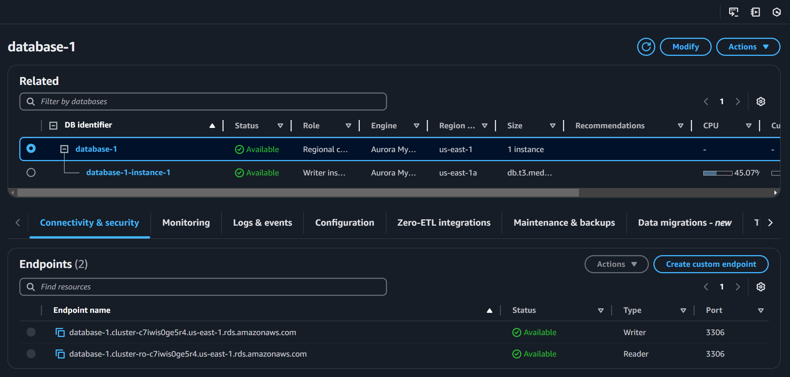
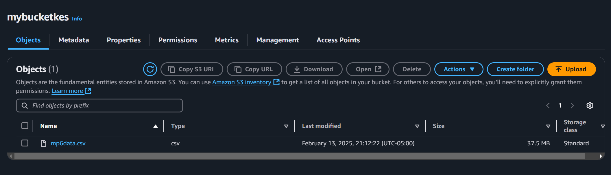
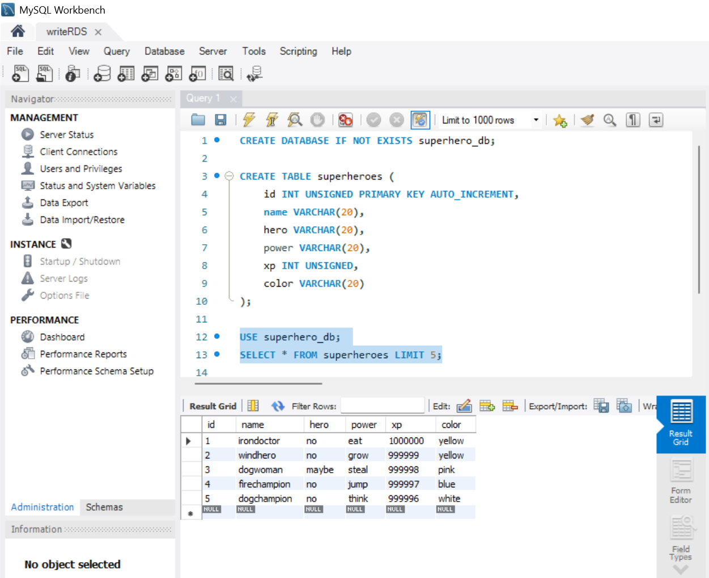
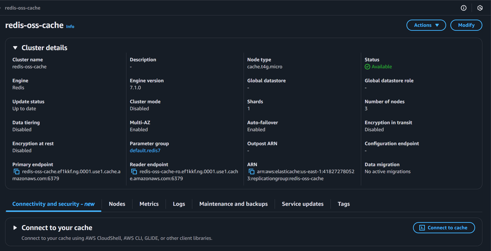
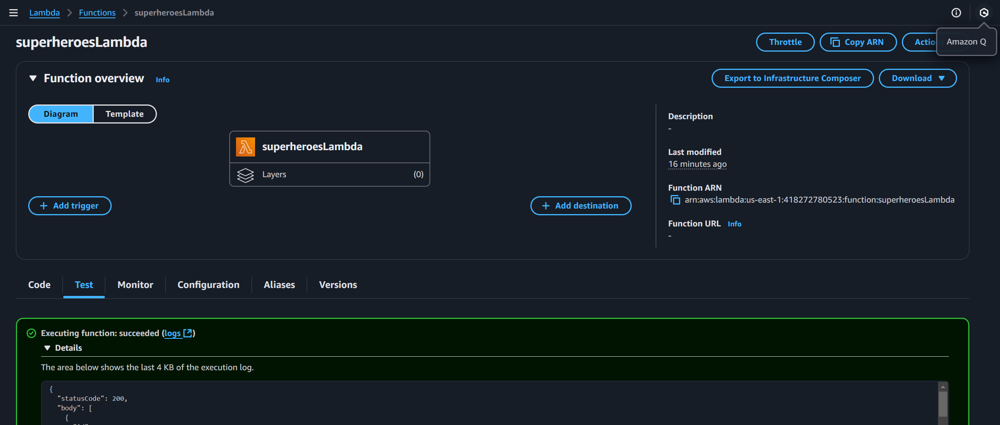
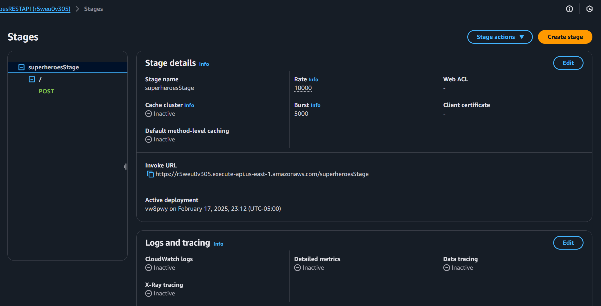

# AWS Serverless Database Application

I designed and implemented a serverless database application using a dataset of superhero user profiles. I built a storage service that manages read and write requests to a relational database, and utilized Redis for efficient caching.

* **RDS Aurora MySQL:** I created and populated an Aurora MySQL database using provided data. This database served as the persistent storage layer for my application.
* **ElastiCache (Redis):** I configured a Redis cluster to function as a cache, and implemented write-through and lazy-loading caching strategies to optimize read and write operations.
* **Lambda:** I developed a Lambda function to facilitate interactions between the Aurora database and the Redis cache. This function was designed to handle both read and write requests, with the necessary caching logic integrated.

## RDS Aurora MySQL

The RDS Aurora MySQL database served as the persistent data storage for my application. It provided a reliable and scalable relational database to store the superhero data.

### S3 Bucket And mp6data.csv

I created an S3 bucket named "mybucketkes" and uploaded the `mp6data.csv` file to it. This file contained the dataset of superhero information, with each line representing a superhero's attributes like name, power, and experience points. The S3 bucket acted as a storage location from which the Aurora database could access and load the data.

### MySQL Workbench And createTable.sql

Using MySQL Workbench, I connected to my RDS Aurora MySQL instance. I then executed the SQL script from `createTable.sql`. This script performed the following actions:

1.  **Created a Database:** It created a database named `superhero_db` if it didn't already exist.
2.  **Created a Table:** It created a table named `superheroes` within the `superhero_db` database, defining columns for `id`, `name`, `hero`, `power`, `xp`, and `color`. The `id` column was configured as an auto-incrementing primary key.
3.  **Loaded Data from S3:** The script used the `LOAD DATA FROM S3` command to directly load the data from the `mp6data.csv` file in my S3 bucket into the `superheroes` table. This efficiently populated the database with the superhero data.
4.  **Verified Data:** A `SELECT` query was used to retrieve and display the first 5 rows of the `superheroes` table, confirming that the data was successfully loaded.

This process allowed me to efficiently create the database structure and populate it with the provided data, establishing the foundation for my application's data storage.

## ElastiCache

ElastiCache (Redis) was used as an in-memory data store to cache frequently accessed data from the Aurora MySQL database. This caching layer significantly improved the read performance of my application by reducing the latency associated with database queries. By storing frequently accessed data in Redis, I could serve read requests much faster, leading to a more responsive application.

### EC2 And redisLayer.sh

To ensure my Redis cluster was created and configured correctly, I launched an EC2 instance and used it to test the connectivity and functionality of the ElastiCache Redis cluster. I performed the following steps:

1.  **EC2 Setup:** I set up the EC2 instance with the necessary tools and libraries, including `ec2-instance-connect`, `stress-ng`, `htop`, `python3-pip`, `gcc`, `jemalloc-devel`, `openssl-devel`, `tcl`, `tcl-devel`, `clang`, and `wget`.
2.  **Redis Client Compilation:** I downloaded the Redis stable source code, extracted it, and compiled it using the clang compiler. This provided me with the `redis-cli` command-line tool.
3.  **Redis Connection Test:** I used the `redis-cli` tool to connect to the primary endpoint of my ElastiCache Redis cluster (`redis-oss-cache.ef1kkf.ng.0001.use1.cache.amazonaws.com:6379`). Successfully connecting to the Redis cluster confirmed that it was running and accessible from my EC2 instance. This test verified that the network configuration, security groups, and Redis cluster settings were all correctly configured, allowing my application to interact with the cache.

## Lambda and API Gateway

The Lambda function formed the core logic of my application, handling read and write requests to the Aurora database and managing the Redis cache. API Gateway provided the necessary endpoint for external access to this Lambda function.

### Lazy Loading

I implemented a lazy loading strategy for read requests. When a read request for a specific 'xp' value was received, the Lambda function first checked if the corresponding data was present in the Redis cache. If it was, the data was retrieved directly from the cache, significantly reducing latency. If the data was not found in the cache (a "cache miss"), the Lambda function queried the Aurora database, retrieved the data, and then stored it in the Redis cache for subsequent requests. This approach ensured that the cache was populated with frequently accessed data on demand, minimizing the need for unnecessary database queries.

### Write Through

For write requests, I employed a write-through caching strategy. Whenever a new superhero record was inserted into the Aurora database, the Lambda function also updated the corresponding entry in the Redis cache. This ensured that the cache remained consistent with the database, eliminating the risk of serving stale data. By updating the cache synchronously with database writes, I maintained data integrity and ensured that subsequent read requests would retrieve the most up-to-date information.

### PyMySQL

The Lambda function utilized the PyMySQL library to interact with the Aurora MySQL database. PyMySQL provided a Python interface for connecting to and querying the database. I used PyMySQL to execute SQL queries for retrieving and inserting data into the `superheroes` table. The `DB` class I created encapsulated the database connection and query execution logic, making it easier to manage database interactions within the Lambda function.

### Redis

The Redis client library for Python was used to connect to and interact with the ElastiCache Redis cluster. Redis served as the caching layer for my application, storing frequently accessed data in memory for faster retrieval. The Lambda function used Redis commands to set and retrieve data from the cache, implementing the lazy loading and write-through caching strategies. The `TTL` variable was used to set an expiration time for cached data, ensuring that the cache remained up-to-date.

### API Gateway

API Gateway was used to create an HTTP endpoint that triggered the Lambda function. This allowed external clients to send read and write requests to my application. I configured API Gateway to use Lambda integration, ensuring that the requests were directly passed to the Lambda function and the responses were returned to the client. This setup provided a scalable and secure way to expose my serverless application to the outside world.

